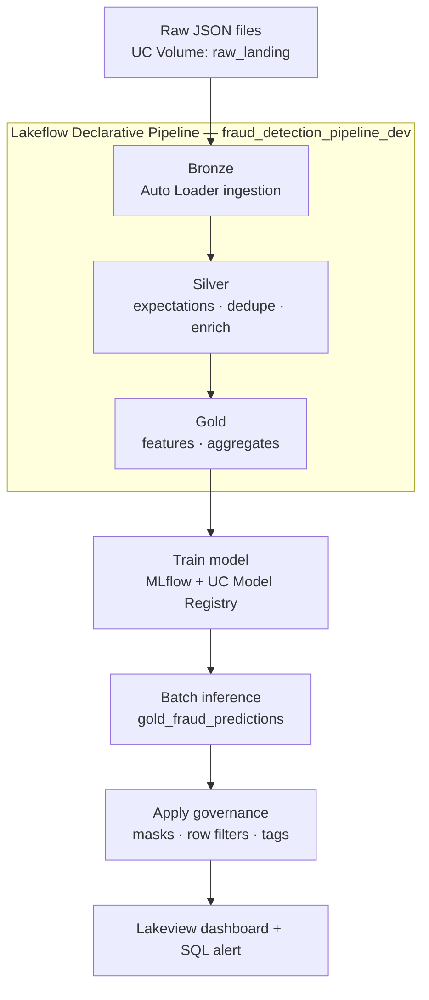
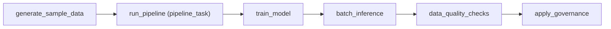

# Fraud Detection Lakehouse — Design Document

**Technical & functional design.** Schema: `workspace.fraud_detection` · Workspace: Databricks Free Edition · Repo: [Vivek-dev-web/fraud-detection-lakehouse](https://github.com/Vivek-dev-web/fraud-detection-lakehouse)

A rendered, navigable version of this document is published as an [Artifact](https://claude.ai/code/artifact/a7333909-c74e-455b-9d48-cfa9fae930d5).

## 1. Purpose & scope

This document specifies what the fraud detection lakehouse does, how each component is built, the trade-offs made along the way, and how to test it further and validate the data it produces.

**In scope:** a synthetic credit-card transaction feed; a declarative bronze/silver/gold pipeline; a trained, registered, and served fraud classifier; Unity Catalog governance controls; a BI dashboard and alert; CI/CD.

**Out of scope:** this is a reference implementation, not a production fraud system. Data is synthetic, ground-truth labels come from a rule-based heuristic rather than investigated cases, and the workspace has a single admin user, which limits how governance effects can be observed (§6).

## 2. Architecture

One Databricks Job orchestrates a Lakeflow pipeline, two ML tasks, and a governance pass. Compute is serverless throughout.



- **Compute** — serverless for the Lakeflow pipeline, all five job tasks, and the SQL warehouse backing the dashboard/alert.
- **Storage** — Unity Catalog managed tables under catalog `workspace`, schema `fraud_detection`. Two managed volumes: `raw_landing` (source files) and `checkpoints` (Auto Loader state).
- **Deployment unit** — a single Databricks Asset Bundle (`databricks.yml`) covering the pipeline, the job, and their dependency graph.

## 3. Data model

| Table | Tier | Object type | Grain |
|---|---|---|---|
| `bronze_accounts` | bronze | materialized view | 1 row / account |
| `bronze_merchants` | bronze | materialized view | 1 row / merchant |
| `bronze_transactions` | bronze | streaming table | 1 row / raw transaction |
| `silver_accounts` | silver | materialized view | 1 row / account, deduped |
| `silver_merchants` | silver | materialized view | 1 row / merchant, deduped |
| `silver_transactions` | silver | streaming table | 1 row / valid transaction, enriched |
| `gold_fraud_features` | gold | materialized view | 1 row / transaction, feature-engineered |
| `gold_daily_fraud_summary` | gold | materialized view | 1 row / date × category × country |
| `gold_account_risk_scores` | gold | materialized view | 1 row / account |
| `gold_fraud_predictions` | gold | managed table | 1 row / scored transaction |
| `gold_dq_results` | gold | managed table | 1 row / data quality check / job run |

### 3.1 Core schemas

**`silver_transactions`**

| Column | Type | Origin |
|---|---|---|
| `transaction_id` | string | bronze |
| `account_id`, `merchant_id` | string | bronze |
| `amount`, `transaction_ts` | double, timestamp | bronze (cast) |
| `is_card_present`, `device_id`, `txn_country` | boolean, string, string | bronze |
| `is_fraud` | boolean, nullable | bronze — null for the live/unlabeled feed |
| `account_name`, `email`, `phone`, `home_country`, `risk_segment` | string | joined from `silver_accounts` |
| `merchant_name`, `category`, `merchant_country` | string | joined from `silver_merchants` |

**`gold_fraud_predictions`**

| Column | Type | Notes |
|---|---|---|
| `transaction_id`, `account_id`, `merchant_id` | string | from `gold_fraud_features` |
| `amount`, `transaction_ts`, `txn_country`, `home_country`, `risk_segment`, `category` | mixed | passthrough context for the dashboard |
| `is_foreign_txn`, `is_high_risk_country`, `txn_count_last_10min`, `amount_zscore` | mixed | the four model input features carried through |
| `fraud_probability` | double [0,1] | model output, rounded to 4dp |
| `predicted_fraud` | boolean | `fraud_probability >= fraud_threshold` (default 0.5) |
| `scored_at` | timestamp | inference run time |

### 3.2 Other registry objects

| Object | Kind | Purpose |
|---|---|---|
| `workspace.fraud_detection.fraud_classifier` | UC registered model | GradientBoostingClassifier, alias `champion` |
| `raw_landing` | UC volume | synthetic source files |
| `checkpoints` | UC volume | Auto Loader streaming state |
| `mask_pii(value)` | SQL function | column mask — redacts unless caller is an admin |
| `row_filter_high_risk(risk_segment)` | SQL function | row filter — hides HIGH-risk rows unless caller is an admin |

## 4. Functional design

### 4.1 Data generation — `transforms/00_generate_sample_data.py`

Synthesizes 500 accounts, 80 merchants, 21,000 labeled historical transactions (30 days × 700/day), and 2,000 unlabeled transactions across 8 streaming batches simulating a live feed — every batch shares one schema, including a nullable `is_fraud`, so Auto Loader never needs schema evolution.

Fraud is injected via two patterns — `large_foreign_cnp` (high amount, card-not-present, high-risk country) and `amount_outlier` — then labeled with a rule (amount / velocity / country thresholds) plus 8% label noise on rule-hits and 1% random false positives, so the dataset is learnable but not trivially rule-matchable.

### 4.2 Bronze — `transforms/bronze.py`

Dimensions are static full-refresh reads. Transactions are ingested incrementally with Auto Loader (`cloudFiles`) from two volume paths — `transactions_labeled` and `transactions_stream` — unioned into one streaming table.

> **Build note:** the hidden `_metadata` column doesn't survive a `unionByName` — it must be extracted into a plain column on each stream individually before combining them. Found via a real pipeline failure, fixed in the current code.

### 4.3 Silver — `transforms/silver.py`

Deduplicates by `_ingest_ts` recency, then applies five hard expectations (dropped on failure) and two soft ones (tracked, not dropped):

| Expectation | Rule | Mode |
|---|---|---|
| `valid_transaction_id` | `transaction_id IS NOT NULL` | drop |
| `valid_account_id` | `account_id IS NOT NULL` | drop |
| `valid_merchant_id` | `merchant_id IS NOT NULL` | drop |
| `positive_amount` | `amount > 0` | drop |
| `valid_currency` | `currency = 'USD'` | drop |
| `known_account` | `account_name IS NOT NULL` | track only |
| `known_merchant` | `merchant_name IS NOT NULL` | track only |

Enrichment is a stream-static broadcast join against `silver_accounts` / `silver_merchants` — no watermark needed since only one side is streaming.

### 4.4 Gold — `transforms/gold.py`

`gold_fraud_features` is a full-refresh materialized view (`dlt.read`, not `dlt.read_stream`) specifically so window functions can see the whole table each run:

- **`txn_count_last_10min`** — count over a 600-second range window, partitioned by account, ordered by transaction time.
- **`amount_zscore`** — `(amount − account_avg) / account_stddev`, guarded against a zero/null stddev for single-transaction accounts.
- **`is_foreign_txn`, `is_high_risk_country`, `hour_of_day`, `day_of_week`** — straightforward derived flags.

`gold_daily_fraud_summary` and `gold_account_risk_scores` aggregate the labeled subset of `gold_fraud_features` for the dashboard.

### 4.5 Model training — `ml/01_train_model.py`

Reads `gold_fraud_features WHERE is_fraud IS NOT NULL` (~21K rows), 80/20 stratified split, trains a `GradientBoostingClassifier(n_estimators=200, max_depth=4, learning_rate=0.05)` on 8 features. Logs precision, recall, F1, ROC-AUC, and average precision to MLflow, registers the model as `workspace.fraud_detection.fraud_classifier`, and points the `champion` alias at the new version — unconditionally, every run (see §7.3.4).

### 4.6 Batch inference — `ml/02_batch_inference.py`

Scores `gold_fraud_features WHERE is_fraud IS NULL` (the live feed) against the `champion` model, writing `gold_fraud_predictions`.

> **Build notes — three platform issues found live:**
> - `mlflow.pyfunc.spark_udf()` delegates to Databricks' serverless UDF-sandbox detection, which fails to parse this workspace's runtime string (`18.x-aarch64-photon-scala2`). Worked around by loading the model directly with `mlflow.sklearn.load_model()` and scoring via a plain `pandas_udf`.
> - `spark.sparkContext.broadcast()` isn't reachable on serverless compute at all — the model is small enough that a closed-over variable (cloudpickled with the UDF) works fine without it.
> - scikit-learn's `_validate_data` checks feature *names*, not just position — `pd.concat` on bare positional Series produces generic `_0.._N` names, so columns must be explicitly relabeled to match the training feature names before calling `predict_proba`.

### 4.7 Automated data quality checks — `governance/04_data_quality_checks.py`

Runs the checks from §8 as a real job task instead of a manual runbook. Each check produces a `CheckResult` (`src/data_quality.py`, pure-Python and unit tested — same split as `src/features.py`) and every result is appended to `gold_dq_results`, keyed by a `run_id` so history accumulates across runs instead of being overwritten.

Checks split into two tiers:

| Tier | Checks | Behavior |
|---|---|---|
| Hard gate | row-count reconciliation, key nulls, surviving duplicates, orphaned foreign keys, domain/range violations (§8.1–§8.4), freshness (§8.6) | Any FAIL raises `AssertionError` and stops the job, gated by the `enforce_quality_gate` job parameter (default `true`) |
| Soft signal | live flagged-fraud rate vs. historical labeled baseline (§8.7) | WARN only, by construction — `drift_check` cannot produce FAIL. Drift is a signal to investigate, not proof the pipeline broke; it must never block the job. |

`max_freshness_minutes` and `max_drift_deviation` are job parameters (defaults `1440` and `0.75`) rather than hardcoded, since what counts as "stale" or "too much drift" is a judgment call that will differ by deployment.

> **Build notes — two issues found on the first live run of this task:**
> - `from src.data_quality import ...` raised `ModuleNotFoundError: No module named 'src'` when run as a bundle-deployed job task — unlike a Databricks Repo, a bundle's synced workspace files don't reliably put the bundle root on `sys.path`. Fixed the same way `transforms/gold.py` relates to `src/features.py`: the notebook reimplements the small pass/fail/warn logic locally instead of importing it; `src/data_quality.py` stays the unit-tested spec.
> - Freshness is measured against `gold_fraud_predictions.scored_at`, not `bronze_transactions._ingest_ts` as first attempted. `00_generate_sample_data.py` uses a fixed seed and writes to the same filenames every run (§4.1), so Auto Loader never reprocesses already-seen files and `_ingest_ts` freezes at whenever the demo data was first ingested — on a repo cloned weeks ago, that check FAILed on a run that had just succeeded. `scored_at` reflects `batch_inference`'s own execution time on every run instead, since it always overwrites.

### 4.8 Governance — `governance/03_apply_governance.py`

Two SQL functions gate on `is_account_group_member('admins')`: `mask_pii` redacts a string column to `***MASKED***`, `row_filter_high_risk` hides rows where `risk_segment = 'HIGH'`. Every `ALTER TABLE` statement is wrapped in try/except and logged as `[OK]` or `[SKIPPED]` — the notebook never fails the job even if a statement is unsupported on a given table.

> **Verified result:** masks and the row filter took effect on `silver_transactions` (streaming table) and `gold_fraud_predictions` (plain managed table). They silently did *not* take effect on `silver_accounts` or `gold_account_risk_scores` — both materialized views. Confirmed directly via `databricks tables get`, not inferred. See §6.

Classification tags (`data_classification=pii` at table level, `pii=true` on individual columns) are applied the same way, on the same subset of tables.

### 4.9 Dashboard & alert — `dashboard/deploy_dashboard.py`

A standalone script (Databricks SDK, run locally — not part of the bundle) publishes a two-page Lakeview dashboard *Fraud Detection Overview*:

- **Fraud Overview page** — a flagged-transaction counter, a fraud-by-category bar chart, and a fraud-rate trend line.
- **Data Quality page** — an open-issues counter (`COUNT_IF(status <> 'PASS')`) and a table of every check from the latest `gold_dq_results` run (name, category, status, value, message), so a customer can see the same PASS/WARN/FAIL detail that gates the job, without needing SQL access.

Plus a SQL alert *High daily fraud rate* that fires when the latest day's fraud rate exceeds 5%. Idempotent by display-name lookup.

> **Build note:** published with `embed_credentials: True`, not `False`. With `False`, every viewer's own live browser session has to execute each widget's query against the warehouse — a session opened via an auto-login link couldn't, and the published page showed "No data" / "Visualization has no fields selected" on every widget even though the same queries returned real data when run directly via the API under the same identity. `True` runs queries as the publisher instead, which is the right tradeoff on a single-admin workspace; revisit if this is ever shared with a viewer who shouldn't see unmasked/unfiltered rows (§6).

### 4.10 Orchestration — `databricks.yml`

One job, `fraud_detection_job_dev`, six sequential tasks:



`run_pipeline` is a native `pipeline_task` referencing the Lakeflow pipeline resource by id — the bundle deploys both as one unit. `data_quality_checks` sits between inference and governance so it validates both the pipeline's tables and the model's predictions before governance runs — and, when the quality gate trips, before governance runs at all.

### 4.11 CI/CD — `.github/workflows/ci.yml` / `azure-pipelines.yml`

Two jobs on every push/PR to `main`: **test** runs the pytest suite; **validate-bundle** runs `databricks bundle validate` against `DATABRICKS_HOST`/`DATABRICKS_TOKEN` credentials, gated to same-repo pushes/PRs.

`azure-pipelines.yml` mirrors the same two stages for the [Azure DevOps project](https://dev.azure.com/vivekjpr/VivekTiwari_Project1), plus a third that GitHub Actions doesn't have — `DATABRICKS_HOST`/`DATABRICKS_TOKEN` are set as pipeline variables in the Azure DevOps UI (the token marked secret) rather than in YAML, since Azure Pipelines doesn't support declaring secret values there. The fork-PR secret restriction GitHub Actions expresses as an explicit `if:` condition is instead an org/project-level setting in Azure DevOps ("Make secrets available to builds of forks"), off by default.

A third stage, **Deploy**, runs `bundle deploy` + `bundle run fraud_detection_job` against the dev target on every real merge to `main` (excluded from PR validation builds via `Build.Reason`). It's a `deployment` job bound to the `databricks-dev` Environment, which carries a manual-approval check configured in the Azure DevOps UI, not in YAML — deliberately, so no YAML change alone could ever skip the approval and trigger a live job run unattended. Boards tracks the project's open bugs and backlog as work items (mirroring `docs/DESIGN.md` §6/§7.3) rather than only living in this document.

## 5. Design decisions

- **Lakeflow over hand-written orchestration** for bronze/silver/gold — declarative expectations and incremental streaming state come for free.
- **ML kept outside the Lakeflow pipeline**, as plain job tasks. Training needs `gold_fraud_features` to already exist, and inference needs a model that's already registered — a linear job DAG handles that ordering cleanly, where forcing it into one declarative pipeline update would not.
- **Direct model loading over `mlflow.pyfunc.spark_udf`** for inference — chosen after hitting the sandbox-parsing bug in §4.6, not as a default preference.
- **Governance as a separate, idempotent post-step** rather than baked into table definitions — masks and row filters are UC metadata operations, cleanly separable from transformation logic, and safe to rerun after a Lakeflow full refresh resets them.
- **One job, one bundle** — the entire pipeline reproduces with a single `databricks bundle run`, at the cost of a fully sequential (not maximally parallel) task graph.
- **Hard gate for integrity/domain checks, WARN-only for drift** (§4.7) — a null key or an out-of-range probability means something upstream is broken and should stop the job; a flagged-rate that drifted from baseline is an investigation prompt, not proof of a broken pipeline, so it's structurally incapable of failing the job (`drift_check` never returns FAIL).

## 6. Known limitations

- **Materialized views don't take masks or row filters.** Verified, not assumed: `silver_accounts` and `gold_account_risk_scores` silently reject `ALTER TABLE ... SET MASK` / `SET ROW FILTER`. PII in `silver_accounts` is therefore *not* actually masked today. Fix options: convert those tables to streaming tables, or apply the mask to a plain managed table built on top instead.
- **Single-admin workspace.** Both governance functions gate on `is_account_group_member('admins')`. With one admin user, the mechanism is wired correctly but never visibly restricts anything.
- **Random train/test split.** `txn_count_last_10min` and `amount_zscore` are order-dependent features; a random stratified split can leak information a time-based split would not.
- **Model promotion is unconditional.** `train_model` always repoints `champion` at the newest version, regardless of whether it's actually better.
- **Dashboard/alert live outside the bundle.** Lakeview dashboards and SQL alerts aren't first-class resources in this CLI's bundle schema — `deploy_dashboard.py` is a manual step.

## 7. Testing strategy

### 7.1 What exists today

25 pytest unit tests: 13 over `src/features.py` (the pure-Python mirror of the Spark feature logic — zero-stddev accounts, empty velocity history, window boundaries, risk-score saturation) and 12 over `src/data_quality.py` (pass/fail/warn boundary conditions for each check type, including that `drift_check` can never return FAIL). Runs on every push via CI. `databricks bundle validate` also runs in CI, but only checks the bundle definition parses and resolves.

Since §4.7, a real data-quality gate also runs as part of every job: `data_quality_checks` executes the §8 checks against live tables and fails the job on any hard-gate violation — not a substitute for the unit tests above (it checks data, not code), but it closes the "no data-quality assertion runs after a deployment" gap that used to be listed here.

### 7.2 Coverage gaps

No integration test actually runs the pipeline. No quality gate exists before promoting a model alias — `data_quality_checks` validates the data and predictions `train_model` already produced, not whether that training run was itself an improvement (see the model-promotion next step below). The Spark transformation code itself (`transforms/*.py`) is untested — only its pure-Python analogue is.

### 7.3 Next steps

1. **Spark-level unit tests.** Add a local-PySpark test suite for `transforms/*.py` — fixture DataFrames exercising the silver expectations and gold window calculations directly.
2. **Scheduled smoke test.** A manually-triggered CI job: deploy to a dedicated test schema, run the job, assert all 10 tables are non-empty, the `champion` alias resolves, and `gold_fraud_predictions` has rows — largely covered now by `gold_dq_results` (§4.7), but a dedicated test-schema run with truncation afterward is still open.
3. **Time-based train/test split.** Hold out the last ~20% of days by `transaction_ts` instead of a random stratified split.
4. **Model quality gate.** Before calling `set_registered_model_alias`, compare the new run's metrics against the current champion's; only promote on improvement.
5. **Threshold tuning.** Sweep `fraud_threshold` from 0.1–0.9 against the labeled validation set, plot precision/recall, choose deliberately.
6. **Governance regression check.** Script the `databricks tables get` inspection used to discover §6's gap, and assert mask/row-filter fields are non-null where expected.
7. **Streaming load test.** Generate a much larger `transactions_stream` (e.g. 50 batches × 5,000 rows) and confirm `trigger(availableNow=True)` still completes in bounded time on serverless.

## 8. Data validation

Concrete checks, runnable against `workspace.fraud_detection` via a SQL warehouse or the `databricks` CLI. §8.1–§8.4 and §8.6 now also run automatically every job as `data_quality_checks` (§4.7) — the queries below are the same ones, kept here as the reference for what each check means and for ad-hoc debugging when a run fails. Results of the automated runs live in `gold_dq_results`:

```sql
SELECT check_name, category, status, actual_value, message
FROM gold_dq_results
WHERE run_id = (SELECT run_id FROM gold_dq_results ORDER BY checked_at DESC LIMIT 1)
ORDER BY status DESC, category;
```

### 8.1 Row-count reconciliation

Expect `silver ≤ bronze` and `gold ≈ silver` (1:1 feature join on unique dimension keys).

```sql
SELECT
  (SELECT COUNT(*) FROM bronze_transactions)  AS bronze,
  (SELECT COUNT(*) FROM silver_transactions)  AS silver,
  (SELECT COUNT(*) FROM gold_fraud_features)  AS gold;
```

### 8.2 Null & duplicate checks

```sql
-- key nulls (should be 0 -- guaranteed by expect_or_drop, worth asserting independently)
SELECT COUNT(*) FROM silver_transactions
WHERE transaction_id IS NULL OR account_id IS NULL OR merchant_id IS NULL;

-- duplicates surviving the dedup window
SELECT transaction_id, COUNT(*) c FROM silver_transactions
GROUP BY transaction_id HAVING c > 1;
```

### 8.3 Referential integrity

```sql
-- transactions whose account_id never resolved to a dimension row
SELECT COUNT(*) FROM bronze_transactions t
LEFT ANTI JOIN silver_accounts a ON t.account_id = a.account_id;

SELECT COUNT(*) FROM bronze_transactions t
LEFT ANTI JOIN silver_merchants m ON t.merchant_id = m.merchant_id;
```

### 8.4 Domain & range checks

```sql
SELECT COUNT(*) FROM silver_transactions WHERE amount <= 0 OR currency <> 'USD';
SELECT COUNT(*) FROM gold_fraud_predictions WHERE fraud_probability NOT BETWEEN 0 AND 1;
SELECT COUNT(*) FROM gold_fraud_features
WHERE hour_of_day NOT BETWEEN 0 AND 23 OR day_of_week NOT BETWEEN 1 AND 7;
```

### 8.5 Expectation metrics

Lakeflow tracks pass/fail counts per expectation natively — read them instead of re-deriving:

```
databricks pipelines list-pipeline-events <pipeline-id> --profile <name>
# filter event_type=flow_progress, inspect data_quality.expectations[]
# or: workspace UI -> Pipelines -> fraud_detection_pipeline_dev -> Data quality tab
```

### 8.6 Freshness

```sql
SELECT MAX(scored_at) FROM gold_fraud_predictions; -- should track the last job run time
```

Not `MAX(_ingest_ts) FROM bronze_transactions` — the sample data generator writes the same filenames every run, so Auto Loader never reprocesses them and `_ingest_ts` freezes at first ingestion (see the build note in §4.7). `scored_at` is rewritten by `batch_inference` on every run regardless.

### 8.7 Label & prediction sanity

```sql
-- historical baseline fraud rate (~3-5% by construction)
SELECT AVG(CAST(is_fraud AS INT)) FROM gold_fraud_features WHERE is_fraud IS NOT NULL;

-- live flagged rate -- large deviation from baseline = model or data drift
SELECT AVG(CAST(predicted_fraud AS INT)) FROM gold_fraud_predictions;

-- probability distribution shouldn't cluster at exactly 0 or 1
SELECT MIN(fraud_probability), AVG(fraud_probability), MAX(fraud_probability)
FROM gold_fraud_predictions;
```

### 8.8 Model artifact

```
databricks model-versions list workspace.fraud_detection.fraud_classifier --profile <name>
# confirm the latest version's status = READY;
# a successful batch_inference run is itself a live test that the
# "champion" alias resolves, since it loads models:/...@champion directly.
```

### 8.9 Governance

```
databricks tables get workspace.fraud_detection.<table> --profile <name>
# inspect columns[].mask and row_filter directly -- this is exactly
# how the materialized-view gap in §6 was discovered, not assumed.
```

## 9. Validation runbook

End to end, after any change to the pipeline or model:

1. Deploy: `databricks bundle deploy --profile <name>`
2. Run: `databricks bundle run fraud_detection_job --profile <name>` and confirm all six tasks succeed — a `data_quality_checks` failure means a hard-gate check failed; the run output prints every check's status, and the same detail is queryable in `gold_dq_results` (§8) and visible on the dashboard's Data Quality page (§4.9).
3. Row counts: run §8.1 — confirm the bronze → silver → gold shape looks right for this run's data volume.
4. Integrity: run §8.2 and §8.3 — zero nulls, zero duplicates, zero orphaned foreign keys.
5. Domain checks: run §8.4 — zero rows outside valid ranges.
6. Expectations: pull the pipeline's data-quality metrics (§8.5) and confirm drop counts are in the expected small range, not a spike.
7. Freshness: run §8.6 — confirm the ingestion timestamp is current.
8. Model sanity: run §8.7 and §8.8 — flagged rate close to the historical baseline, probabilities spread across the range, model version `READY`.
9. Governance: run §8.9 against the four target tables — confirm masks/row filter are present on `silver_transactions` and `gold_fraud_predictions`, and note if the materialized-view gap in §6 has been addressed.
10. Redeploy the dashboard/alert only if a table's schema changed: `python dashboard/deploy_dashboard.py --profile <name> --catalog workspace --schema fraud_detection --warehouse-id <id>`
